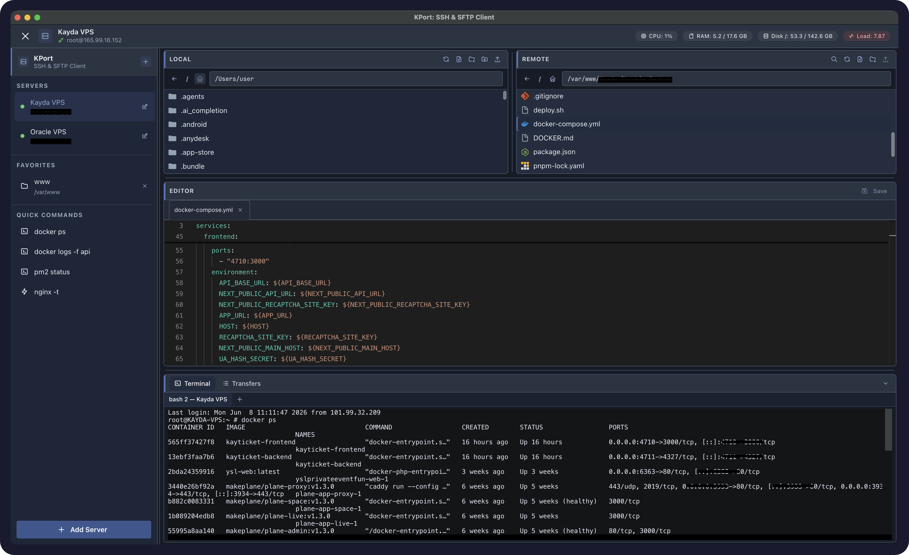

# KPort: SSH & SFTP Client

A cross-platform desktop client for developers who manage remote servers daily. KPort combines SSH connectivity, SFTP file browsing, and in-app editing in a single workspace—so you spend less time switching between WinSCP, terminals, and editors.

> **Status:** `v0.1.0` — MVP ready. Connect, browse, edit, transfer, terminal, and monitoring in one app.



*Browse local and remote files, edit on the server, run commands, and monitor CPU/RAM/disk — without leaving the app.*

## Features

| Area | Status |
|------|--------|
| Server profiles (add, edit, delete) | Done |
| SSH connect & connection test | Done |
| Dual file explorer (local + remote SFTP) | Done |
| Path bar with autocomplete & `cd ..` navigation | Done |
| File ops (mkdir, rename, delete) local + remote | Done |
| Upload/download + folder transfer + queue | Done |
| Monaco editor — open & save local/remote files | Done |
| SSH terminal (xterm, multi-tab) | Done |
| Favorites, quick commands, remote file search | Done |
| Server metrics + threshold warnings in header | Done |
| Installer (`.dmg` / `.exe` / `.AppImage`) | CI release on push to `main` |

## Tech stack

| Layer | Technologies |
|-------|----------------|
| Desktop | Electron 33, electron-vite |
| UI | React 18, TypeScript, Mantine 7, Tabler Icons |
| Editor | Monaco Editor |
| State | Zustand |
| Main process | `ssh2`, `better-sqlite3`, Node `fs` |
| IPC | `contextBridge` preload bridge (no Node in renderer) |

## Prerequisites

- **Node.js** 20+ (LTS recommended)
- **Yarn** 1.x

Native modules (`better-sqlite3`) are rebuilt automatically on `yarn install` via `electron-rebuild`.

## Getting started

```bash
# Clone and install
yarn install

# Start development (Vite HMR + Electron)
yarn dev
```

On macOS, `yarn dev` prepares a custom Electron app shell so the Dock shows **KPort: SSH & SFTP Client** and the project icon during development.

## Scripts

| Command | Description |
|---------|-------------|
| `yarn dev` | Dev server + Electron (macOS Dock branding) |
| `yarn build` | Production compile → `out/` |
| `yarn preview` | Run the production build locally |
| `yarn typecheck` | TypeScript check (renderer + main/preload) |
| `yarn prepare:electron-shell` | Rebuild macOS dev app shell (Dock name & icon) |

## Building

### Production compile

```bash
yarn typecheck   # optional
yarn build
yarn preview     # smoke-test the build
```

Artifacts are written to `out/`:

```
out/
├── main/           # Electron main process
├── preload/        # IPC preload script
├── renderer/       # Bundled React app
└── resources/      # App icons (copied at build time)
```

### Distributable installers

**CI (recommended):** Every push to `main` triggers [`.github/workflows/release.yml`](./.github/workflows/release.yml) — builds macOS (`.dmg`/`.zip`), Windows (`.exe`), Linux (`.AppImage`/`.deb`) and publishes a GitHub Release (`v{version}.build.{n}`).

**Local packaging:**

```bash
yarn dist        # current OS
yarn dist:mac    # macOS only
yarn dist:win    # Windows only
yarn dist:linux  # Linux only
```

Output: `release/`. Requires `resources/icon.{icns,ico,png}` (committed or via `yarn generate:icons`).

## Project structure

```
kport/
├── resources/              # App icons & static assets
├── scripts/
│   ├── dev.js              # Dev entry (Electron shell on macOS)
│   └── prepare-electron-shell.js
├── src/
│   ├── main/               # Electron main: SSH, SFTP, SQLite, fs
│   ├── preload/            # contextBridge IPC API
│   ├── shared/             # Types & constants shared across processes
│   └── renderer/
│       └── src/
│           ├── components/ # UI panels & layout
│           ├── hooks/      # Feature hooks
│           ├── services/   # IPC clients (ssh, sftp, fs, …)
│           └── stores/     # Zustand stores
├── docs/
│   ├── screenshots/        # README & marketing images
│   ├── IDEA.md             # Product vision & MVP scope
│   └── PLAN.md             # UI-first development roadmap
└── electron.vite.config.ts
```

## Architecture

```
┌─────────────────────────────────────────────────────────┐
│  Renderer (React)                                       │
│  Mantine UI · Zustand · Monaco · services → window.kport│
└───────────────────────────┬─────────────────────────────┘
                            │ contextBridge
┌───────────────────────────▼─────────────────────────────┐
│  Preload                                                │
│  Typed IPC facade (no direct Node exposure)               │
└───────────────────────────┬─────────────────────────────┘
                            │ ipcMain / ipcRenderer
┌───────────────────────────▼─────────────────────────────┐
│  Main process                                           │
│  ConnectionManager · SQLite · ssh2 · SFTP · local fs    │
└─────────────────────────────────────────────────────────┘
```

Security model: the renderer never receives Node integration; all privileged work goes through the preload API.

## Documentation

- [docs/IDEA.md](./docs/IDEA.md) — product vision, target users, MVP feature list
- [docs/PLAN.md](./docs/PLAN.md) — phased roadmap (UI-first → backend wiring)

## Development notes

- **Scaffolding:** This repo follows the [electron-vite](https://electron-vite.org/) layout. It was scaffolded manually because `yarn create electron-vite` can fail on macOS with a CRLF shebang error (`env: node\r: No such file or directory`).
- **Native modules:** After upgrading Electron, run `yarn install` again to trigger `electron-rebuild` for `better-sqlite3`.
- **Gitignored paths:** `out/`, `dist/`, `.electron/`, `*.db` (runtime SQLite).
