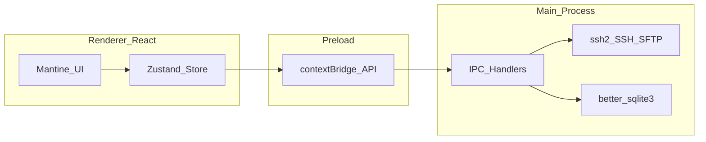
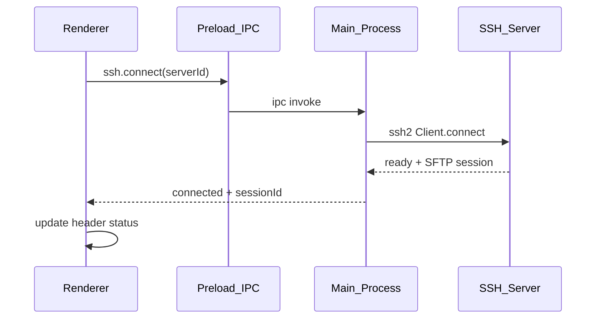

# KPort Development Plan (UI-first)

> Implementation roadmap for [IDEA.md](./IDEA.md).  
> Strategy: **UI demo with mock data first**, then wire Electron main process feature by feature.

---

## Principles

| Principle               | Description                                                                             |
| ----------------------- | --------------------------------------------------------------------------------------- |
| **UI-first**            | Every feature starts with mock data + Zustand store before touching `ssh2`.             |
| **Secure Electron**     | Renderer has no Node access. All I/O goes through preload `contextBridge` + typed IPC.  |
| **Incremental**         | App must run and remain demo-able after every phase — no big-bang integration.          |
| **Swap, don't rewrite** | Phase 0 builds the full shell; later phases replace mock providers with real IPC calls. |

### Stack

From [IDEA.md — Tech Stack](./IDEA.md#tech-stack):

- **Desktop:** Electron, React, TypeScript
- **UI:** Mantine, Tabler Icons, Monaco Editor, xterm.js
- **Main process:** `ssh2`, `better-sqlite3`
- **Tooling:** [electron-vite](https://electron-vite.org/) (recommended scaffold + HMR)

### Architecture



### Target project structure (after Phase 0)

```
kport/
├── IDEA.md
├── PLAN.md
├── package.json
├── electron.vite.config.ts
├── src/
│   ├── main/              # IPC handlers, ssh, db
│   ├── preload/           # contextBridge API
│   └── renderer/
│       ├── components/    # layout, sidebar, explorer, editor, terminal...
│       ├── mocks/         # mock data (Phase 0–1)
│       ├── stores/        # Zustand stores
│       └── types/         # shared UI ↔ IPC types
```

---

## Phase overview

| Phase | Name              | UI demo                  | Wire real                   | Maps to [IDEA roadmap](./IDEA.md#development-roadmap) |
| ----- | ----------------- | ------------------------ | --------------------------- | ----------------------------------------------------- |
| 0     | UI Demo Shell     | Full layout + mocks      | electron-vite scaffold only | — (new; precedes IDEA Phase 1)                        |
| 1     | Server Management | Reuse Phase 0 forms      | SQLite CRUD                 | Part of IDEA Phase 1                                  |
| 2     | SSH Connection    | Status dots, header      | `ssh2` connect/test         | Part of IDEA Phase 1                                  |
| 3     | File Explorer     | Reuse dual explorer      | SFTP + local `fs`           | Part of IDEA Phase 1                                  |
| 4     | File Transfer     | Reuse transfer queue     | Upload/download worker      | Part of IDEA Phase 1                                  |
| 5     | Code Editor       | Reuse Monaco tabs        | readFile / writeFile        | Part of IDEA Phase 2                                  |
| 6     | SSH Terminal      | Reuse xterm tabs         | `ssh2` shell stream         | Part of IDEA Phase 2                                  |
| 7     | Productivity      | Favorites, quick cmds UI | SQLite + clipboard + find   | IDEA Phase 3                                          |
| 8     | Monitoring        | Header metric badges     | SSH exec polling            | IDEA Phase 4                                          |
| 9     | Future            | —                        | Backlog                     | IDEA Phase 4 + Future Features                        |

### IDEA roadmap cross-reference

[IDEA.md](./IDEA.md) groups features by capability. This plan splits each capability into **UI shell → backend wire** and adds Phase 0 upfront.

| IDEA phase   | IDEA items                                  | This plan                                   |
| ------------ | ------------------------------------------- | ------------------------------------------- |
| IDEA Phase 1 | Electron setup, SSH, SFTP, upload, download | Phase 0 (scaffold + UI) → Phase 1–4         |
| IDEA Phase 2 | Monaco, terminal, tabs, open terminal here  | Phase 5–6                                   |
| IDEA Phase 3 | Transfer queue, favorites, quick commands   | Phase 4 (queue) + Phase 7 (favorites, cmds) |
| IDEA Phase 4 | Monitoring, health, Docker                  | Phase 8 + Phase 9                           |

### Recommended ship order (if compressed)

1. **Phase 0** — UI demo (mandatory first step)
2. **Phase 1 + 2** — servers + SSH
3. **Phase 3 + 5** — browse + edit (core value)
4. **Phase 6** — terminal
5. **Phase 4** — transfer queue
6. **Phase 7 + 8** — polish

---

## Phase 0 — UI Demo Shell

**Goal:** Clickable product demo with full layout. No real SSH.

### UI demo

| Area         | Content                                            |
| ------------ | -------------------------------------------------- |
| Left sidebar | Server list, Favorites, Quick Commands (mock)      |
| Top header   | CPU / RAM / Disk / Load badges (mock numbers)      |
| Main         | Dual file explorer (Local \| Remote) + Editor tabs |
| Bottom panel | Terminal tabs + Transfer queue (toggle / resize)   |

**Deliverables:**

- App shell: sidebar collapse, bottom panel resize
- Modals: Add / Edit Server (all fields from [IDEA — Server Management](./IDEA.md#server-management))
- Explorer context menu: Open, Rename, Delete, Upload, Download, Copy Path, Open Terminal Here → toast or console log only
- Explorer folder click / breadcrumb: navigates **explorer only** — no terminal cwd side effects
- Monaco: syntax highlighting, multi-tab, dirty indicator `*`
- xterm.js: fake prompt + local echo (not SSH); **multiple terminal tabs**, each with isolated history/input; **+** to add tab
- Transfer queue: Uploading / Downloading / Completed / Failed with animated progress bars
- Dark theme (Mantine) + Tabler Icons

**Mock layer:** `src/renderer/mocks/` — `servers.ts`, `fileTree.ts`, `metrics.ts`, `transfers.ts`

**Wire real:** Minimal electron-vite scaffold; window opens. No IPC beyond dev tooling.

### Done when

- Can record a demo video showing Connect → Browse → Edit → Terminal flow without a real server
- All layout regions from [IDEA — User Interface Layout](./IDEA.md#user-interface-layout) are present

---

## Phase 1 — Server Management

**Goal:** Persist server list locally; UI no longer hardcoded.

### UI demo

Reuse Phase 0 server list, Add/Edit modal, favorite toggle. Loading and empty states.

### Wire real

- Preload API: `servers.list`, `servers.create`, `servers.update`, `servers.delete`
- SQLite table `servers`:

  | Column             | Type    | Notes                       |
  | ------------------ | ------- | --------------------------- |
  | id                 | TEXT PK | UUID                        |
  | name               | TEXT    | Display name                |
  | host               | TEXT    |                             |
  | port               | INTEGER | Default 22                  |
  | username           | TEXT    |                             |
  | auth_type          | TEXT    | `password` \| `private_key` |
  | password_encrypted | TEXT    | Nullable                    |
  | private_key_path   | TEXT    | Nullable                    |
  | is_favorite        | INTEGER | 0 / 1                       |
  | created_at         | TEXT    | ISO timestamp               |

- Main process IPC handlers + simple migration
- Replace mock server store with IPC data
- **Connect button:** fake `connected` state or disabled with tooltip "Available in Phase 2"

### Security note

Phase 1 uses basic credential storage. Before public release: OS keychain integration or encrypt-at-rest (see Phase 9).

### Done when

- Server CRUD + favorite survive app restart
- No mock data in server list

---

## Phase 2 — SSH Connection Flow

**Goal:** Real connect, disconnect, and test connection via `ssh2`.

### UI demo

- Server row status dot: `disconnected` | `connecting` | `connected` | `error`
- Header: hostname, reconnect, disconnect
- Test Connection in modal → success/fail toast with error message

### Wire real



- `ConnectionManager`: `sessionId → { sshClient, sftp }`
- IPC: `ssh.connect`, `ssh.disconnect`, `ssh.test`, `ssh.getStatus`
- Connection timeout + mapped errors (auth failure, host unreachable, timeout)

### Done when

- Connect to a real VPS in seconds
- Clean disconnect releases resources
- Test Connection from server form works

---

## Phase 3 — Remote File Explorer (SFTP)

**Goal:** Browse real remote directories; local explorer reads host filesystem.

### UI demo

Reuse Phase 0 dual explorer. Add loading spinners, error banners, breadcrumb (if not already present).

### Wire real

- IPC: `sftp.list`, `sftp.mkdir`, `sftp.rename`, `sftp.delete`
- Remote tree: lazy folder load, breadcrumb navigation
- Local tree: `dialog.showOpenDialog` for root or default to home directory via `fs`
- Context menu actions call real SFTP (remote) or `fs` (local)
- Double-click folder → navigate explorer only; double-click file → open editor tab (content wired in Phase 5)
- **No coupling to terminal cwd** — tree navigation must not call `cd` or update any terminal tab

### Done when

- Browse `/var/www` (or equivalent) on a connected server
- Create, rename, delete files and folders on remote

---

## Phase 4 — File Transfer

**Goal:** Real upload/download with live transfer queue.

### UI demo

Reuse Phase 0 transfer queue panel. Wire to store events instead of static mocks.

### Wire real

- IPC: `transfer.upload`, `transfer.download`, `transfer.cancel`, `transfer.retry`
- Main: queue worker; push `transfer:progress` events to renderer
- Single file upload/download first; then recursive folder transfer
- Limits (document in code): max depth, max concurrent jobs, cancel in-flight streams
- Optional: drag-and-drop local → remote

### Done when

- Upload a deploy artifact and download a log file
- Queue shows uploading / completed / failed with retry and cancel

---

## Phase 5 — Code Editor (Monaco)

**Goal:** Open → download → edit → save → upload workflow.

### UI demo

Reuse Phase 0 Monaco tabs. Wire open/save actions to store; content from mock until IPC ready.

### Wire real

- IPC: `sftp.readFile`, `sftp.writeFile`
- Open tab: fetch remote content; set Monaco language from file extension
- Save (`Cmd+S` / `Ctrl+S`): upload if dirty; toast on success/failure
- Close dirty tab → confirmation dialog
- Search / replace: Monaco built-in

Supported languages per [IDEA — Code Editor](./IDEA.md#code-editor).

### Done when

- Edit `.env`, `nginx.conf`, or similar on server and save back successfully

---

## Phase 6 — SSH Terminal

**Goal:** Real interactive terminal over SSH shell channel.

### UI demo

Reuse Phase 0 xterm tabs. Multiple tabs, **+** to add tab, active tab indicator, panel toggle.

### Wire real

- IPC: `terminal.create`, `terminal.write`, `terminal.resize`, `terminal.destroy`
- Main: `sshClient.shell()` stream ↔ xterm (via IPC byte forwarding)
- **One SSH shell channel per terminal tab** (`terminalId`), all tabs share the same `sessionId` (server connection) but **not** the same cwd or scrollback
- Renderer model: `TerminalTab { id, title, sessionId, terminalId, initialCwd?, ... }` — cwd is metadata for prompt display; actual cwd lives on the server shell unless user runs `cd`
- Copy / paste, fit-on-resize addon
- **Explorer navigation does not sync cwd** — browsing the remote tree never updates open terminals
- **Open Terminal Here only:** context menu → `terminal.create({ sessionId, initialCwd })` → new tab → after shell ready, write `cd <path>\n` **once** in that tab; leave other tabs untouched

> **Note:** `node-pty` is only needed for a **local** shell. SSH terminals use the `ssh2` shell stream, not `node-pty`.

> **Design rule:** Multiple tabs exist so users can work in parallel directories. Auto-following explorer clicks would fight that model and surprise users who expect each tab to stay put.

### Done when

- Run `docker ps`, `pm2 status`, `nginx -t` on a connected server from the app

---

## Phase 7 — Productivity Layer

**Goal:** Speed features — mostly DB + UI wiring.

### UI demo

Sidebar sections for Favorites and Quick Commands (mock in Phase 0; now persisted).

### Wire real

| Feature              | Implementation                                       |
| -------------------- | ---------------------------------------------------- |
| Favorite directories | SQLite, per server; click → navigate remote explorer only (not terminal cwd) |
| Quick commands       | SQLite; click → inject into **active** terminal tab only (does not change explorer path) |
| Open Terminal Here   | New terminal tab + one-time `cd` (Phase 6); never updates existing tabs |
| Copy path            | Clipboard API on selected file                       |
| Search remote files  | SSH exec `find` with path scope + timeout            |

Examples from [IDEA — Productivity Features](./IDEA.md#productivity-features).

### Done when

- Bookmark `/var/www`, one-click `nginx -t`, search `nginx.conf` under `/etc`

---

## Phase 8 — Monitoring + Health Warnings

**Goal:** Live server metrics in header; threshold warnings.

### UI demo

Reuse Phase 0 header badges. Warning styling when mock values exceed thresholds.

### Wire real

- Poll every 5s while connected (configurable)
- Linux-first parsers: `free`, `df`, `/proc/loadavg` (or equivalent SSH exec)
- IPC: `metrics.subscribe` / `metrics:update` push events
- Thresholds from [IDEA — Health Warnings](./IDEA.md#health-warnings): CPU > 90%, RAM > 85%, Disk > 90%, high load

### Done when

- Header reflects real server stats
- Warning badges appear when thresholds exceeded

---

## Phase 9 — Future (backlog)

Does not block MVP. Items from [IDEA — Future Features](./IDEA.md#future-features):

- Docker integration (CLI wrapper)
- Log viewer presets (Nginx, PM2, Docker)
- File comparison (local vs remote diff)
- Permission manager (`chmod`, `chown`)
- Credential keychain hardening
- `electron-builder` packaging (Windows, macOS, Linux)

Non-goals for early versions: see [IDEA — Non Goals](./IDEA.md#non-goals).

---

## IPC API sketch

Typed preload surface exposed as `window.kport`. Channels grouped by phase.

### Phase 1 — Servers

| Method           | Type   | Description            |
| ---------------- | ------ | ---------------------- |
| `servers.list`   | invoke | List all saved servers |
| `servers.create` | invoke | Create server record   |
| `servers.update` | invoke | Update server record   |
| `servers.delete` | invoke | Delete server record   |

### Phase 2 — SSH

| Method           | Type   | Description                                 |
| ---------------- | ------ | ------------------------------------------- |
| `ssh.connect`    | invoke | Connect; returns `{ sessionId }`            |
| `ssh.disconnect` | invoke | Tear down session                           |
| `ssh.test`       | invoke | Test credentials without persisting session |
| `ssh.getStatus`  | invoke | `{ serverId, status, error? }`              |

### Phase 3 — SFTP

| Method        | Type   | Description                     |
| ------------- | ------ | ------------------------------- |
| `sftp.list`   | invoke | `{ sessionId, path }` → entries |
| `sftp.mkdir`  | invoke | Create remote directory         |
| `sftp.rename` | invoke | Rename remote path              |
| `sftp.delete` | invoke | Delete remote file or directory |

### Phase 4 — Transfer

| Method              | Type   | Description                       |
| ------------------- | ------ | --------------------------------- |
| `transfer.upload`   | invoke | Enqueue upload job                |
| `transfer.download` | invoke | Enqueue download job              |
| `transfer.cancel`   | invoke | Cancel job by id                  |
| `transfer.retry`    | invoke | Retry failed job                  |
| `transfer:progress` | event  | `{ jobId, bytes, total, status }` |

### Phase 5 — Editor

| Method           | Type   | Description                         |
| ---------------- | ------ | ----------------------------------- |
| `sftp.readFile`  | invoke | Read remote file as string / buffer |
| `sftp.writeFile` | invoke | Write content to remote path        |

### Phase 6 — Terminal

| Method             | Type   | Description                              |
| ------------------ | ------ | ---------------------------------------- |
| `terminal.create`  | invoke | `{ sessionId, initialCwd? }` → `{ terminalId }` — `initialCwd` only for **new** tab (Open Terminal Here); not used on explorer browse |
| `terminal.write`   | invoke | Send input bytes                         |
| `terminal.resize`  | invoke | `{ cols, rows }`                         |
| `terminal.destroy` | invoke | Close terminal session                   |
| `terminal:data`    | event  | Output stream to renderer                |

### Phase 7 — Productivity

| Method                     | Type   | Description               |
| -------------------------- | ------ | ------------------------- |
| `favorites.list`           | invoke | List favorites for server |
| `favorites.add` / `remove` | invoke | Manage bookmarks          |
| `commands.list`            | invoke | Quick commands CRUD       |
| `search.files`             | invoke | Remote filename search    |

### Phase 8 — Metrics

| Method                | Type   | Description                |
| --------------------- | ------ | -------------------------- |
| `metrics.subscribe`   | invoke | Start polling for session  |
| `metrics.unsubscribe` | invoke | Stop polling               |
| `metrics:update`      | event  | `{ cpu, ram, disk, load }` |

---

## Mock data contract

Types in `src/renderer/types/` should match IPC payloads so UI can swap mock → real without component changes.

```typescript
// Server (Phase 0 mock → Phase 1 IPC)
interface Server {
  id: string;
  name: string;
  host: string;
  port: number;
  username: string;
  authType: "password" | "private_key";
  isFavorite: boolean;
  status?: "disconnected" | "connecting" | "connected" | "error";
}

// File entry (Phase 0 mock → Phase 3 IPC)
interface FileEntry {
  name: string;
  path: string;
  type: "file" | "directory";
  size?: number;
  modifiedAt?: string;
}

// Editor tab (Phase 0 mock → Phase 5 IPC)
interface EditorTab {
  id: string;
  path: string;
  language: string;
  content: string;
  isDirty: boolean;
}

// Terminal tab (Phase 0 mock → Phase 6 IPC) — one shell per tab; independent of explorer navigation
interface TerminalTab {
  id: string;
  title: string; // e.g. "bash — /var/www/api"
  sessionId: string;
  terminalId?: string; // set after terminal.create
  initialCwd?: string; // optional snapshot when opened via Open Terminal Here
  // Explorer cwd is NOT mirrored here; user cd's in the shell update server state only
}

// Transfer job (Phase 0 mock → Phase 4 IPC)
interface TransferJob {
  id: string;
  direction: "upload" | "download";
  localPath: string;
  remotePath: string;
  status: "queued" | "active" | "completed" | "failed" | "cancelled";
  progress: number; // 0–100
  error?: string;
}

// Server metrics (Phase 0 mock → Phase 8 IPC)
interface ServerMetrics {
  cpuPercent: number;
  ramUsedGb: number;
  ramTotalGb: number;
  diskUsedGb: number;
  diskTotalGb: number;
  loadAverage: number;
}

// Quick command / favorite (Phase 0 mock → Phase 7 IPC)
interface FavoriteDirectory {
  id: string;
  serverId: string;
  path: string;
  label: string;
}

interface QuickCommand {
  id: string;
  label: string;
  command: string;
  group?: string;
}
```

**Provider pattern:** Each store reads from a `*Provider` interface (`MockServerProvider`, later `IpcServerProvider`). Phase 0 implements mocks; later phases add IPC implementations and flip a single flag or DI binding.

---

## Risks and mitigations

| Risk                                            | Mitigation                                                        |
| ----------------------------------------------- | ----------------------------------------------------------------- |
| Plaintext credentials in SQLite                 | Phase 9 keychain; encrypt-at-rest before any public build         |
| `ssh2` / native module rebuild on Electron bump | Pin Electron version; `electron-rebuild` in CI                    |
| Metrics parsing differs across distros          | Linux-first; graceful fallback UI when parse fails                |
| Large file edit in Monaco                       | Size limit warning; stream/binary out of scope for MVP            |
| Remote `find` slow on large trees               | Scoped path, timeout, cancel button                               |
| Scope creep                                     | [IDEA Non Goals](./IDEA.md#non-goals) — defer FTP, Git, K8s, etc. |

---

## Success criteria

From [IDEA — Success Criteria](./IDEA.md#success-criteria). MVP is met when Phases 0–6 (minimum) and ideally 4 + 8 are complete:

- Connect to a server within seconds
- Edit remote files
- Upload deployments
- View logs (terminal + Phase 9 log viewer)
- Restart services (terminal)
- Troubleshoot production issues

All without leaving the application.
