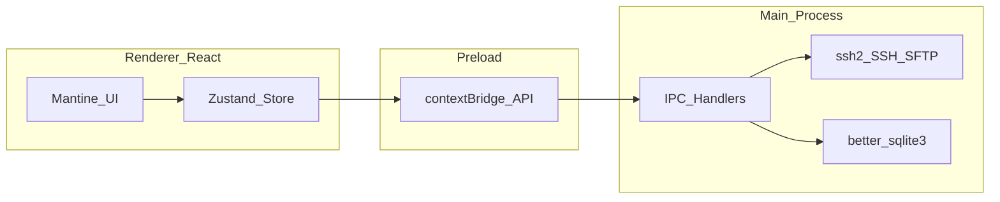
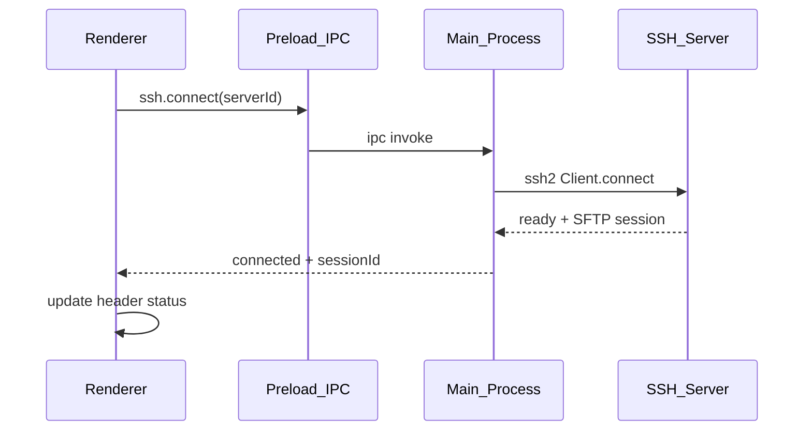

# KPort Development Plan (UI-first)

> Implementation roadmap for [IDEA.md](./IDEA.md).  
> Strategy: **UI demo with mock data first**, then wire Electron main process feature by feature.

**Last updated:** 2026-06-05 · **App version:** `v0.1.0`

---

## Current status

MVP core loop works on a real server: **connect → browse (local + remote) → edit → save → terminal → live metrics**.

| Phase | Status | Notes |
| ----- | ------ | ----- |
| 0 UI shell | ✅ Done | Full layout, resize, dark theme |
| 1 Servers | ✅ Done | SQLite CRUD + favorite toggle |
| 2 SSH | ✅ Done | Connect / disconnect / test / status |
| 3 Explorer | ✅ Done | Browse + mutations + local root picker; unzip backlog |
| 4 Transfer | ✅ Done | Single + folder transfer, drag-drop, queue UI |
| 5 Editor | ✅ Done | Monaco open/save local + remote |
| 6 Terminal | ✅ Done | xterm + `ssh2` shell, multi-tab, Open Terminal Here |
| 7 Productivity | ✅ Done | SQLite favorites + quick cmds + remote file search |
| 8 Monitoring | ✅ Done | Live metrics polling + threshold warning badges |
| 9 Future | ⬜ Backlog | Packaging, keychain, Docker, etc. |

**Also shipped (not a PLAN phase):** app branding (`KPort: SSH & SFTP Client`), icon pipeline (`scripts/generate-app-icon.js`), macOS dev Dock shell (`scripts/prepare-electron-shell.js`).

### Next up (recommended order)

1. **Phase 8** — CPU/RAM/disk threshold warnings in header
2. **Phase 9** — Credential encryption + release signing docs
3. **Phase 8 polish** — CPU/RAM/disk threshold warnings in header
4. **Phase 8 polish** — CPU/RAM/disk threshold warnings in header
5. **Phase 9** — Code signing / notarization + credential hardening

---

## Principles

| Principle               | Description                                                                             |
| ----------------------- | --------------------------------------------------------------------------------------- |
| **UI-first**            | Every feature starts with mock data + Zustand store before touching `ssh2`.             |
| **Secure Electron**     | Renderer has no Node access. All I/O goes through preload `contextBridge` + typed IPC.  |
| **Incremental**         | App must run and remain demo-able after every phase — no big-bang integration.          |
| **Swap, don't rewrite** | Phase 0 builds the full shell; later phases replace mock providers with real IPC calls. |

### Stack

From [IDEA.md — Tech Stack](./IDEA.md#tech-stack):

- **Desktop:** Electron, React, TypeScript
- **UI:** Mantine, Tabler Icons, Monaco Editor, xterm.js
- **Main process:** `ssh2`, `better-sqlite3`
- **Tooling:** [electron-vite](https://electron-vite.org/) (recommended scaffold + HMR)

### Architecture



### Project structure (current)

```
kport/
├── docs/IDEA.md, PLAN.md
├── assets/                # icon-full-size.png (source)
├── resources/             # Generated platform icons
├── scripts/               # dev.js, generate-app-icon.js, prepare-electron-shell.js
├── electron.vite.config.ts
└── src/
    ├── main/              # IPC, ConnectionManager, terminal-manager, SQLite
    ├── preload/           # window.kport API
    ├── shared/            # IPC channels, types (ssh, sftp, terminal, …)
    └── renderer/src/
        ├── components/    # layout, explorer, editor, terminal (xterm)…
        ├── hooks/         # useFileExplorer, useXTermSession, …
        ├── services/      # IPC clients (ssh, sftp, terminal, fs)
        ├── stores/        # Zustand
        └── mocks/         # transfers, favorites, quickCommands (still used)
```

---

## Phase overview

| Phase | Name              | Status | UI demo                  | Wire real                   | Maps to [IDEA roadmap](./IDEA.md#development-roadmap) |
| ----- | ----------------- | ------ | ------------------------ | --------------------------- | ----------------------------------------------------- |
| 0     | UI Demo Shell     | ✅     | Full layout + mocks      | electron-vite scaffold      | — (new; precedes IDEA Phase 1)                        |
| 1     | Server Management | ✅     | Forms + list             | SQLite CRUD                 | Part of IDEA Phase 1                                  |
| 2     | SSH Connection    | ✅     | Status dots, header      | `ssh2` connect/test         | Part of IDEA Phase 1                                  |
| 3     | File Explorer     | ✅     | Dual explorer + path bar | SFTP/FS list + mutations    | Part of IDEA Phase 1                                  |
| 4     | File Transfer     | ✅     | Transfer queue panel     | Upload/download + folders   | Part of IDEA Phase 1                                  |
| 5     | Code Editor       | ✅     | Monaco tabs              | readFile / writeFile        | Part of IDEA Phase 2                                  |
| 6     | SSH Terminal      | ✅     | xterm multi-tab          | `ssh2` shell stream         | Part of IDEA Phase 2                                  |
| 7     | Productivity      | ✅     | Favorites, quick cmds UI | SQLite + search + favorites | IDEA Phase 3                                          |
| 8     | Monitoring        | ✅     | Header badges            | SSH exec polling + warnings | IDEA Phase 4                                          |
| 9     | Future            | ⬜     | —                        | Backlog                     | IDEA Phase 4 + Future Features                        |

### IDEA roadmap cross-reference

[IDEA.md](./IDEA.md) groups features by capability. This plan splits each capability into **UI shell → backend wire** and adds Phase 0 upfront.

| IDEA phase   | IDEA items                                  | This plan                                   |
| ------------ | ------------------------------------------- | ------------------------------------------- |
| IDEA Phase 1 | Electron setup, SSH, SFTP, upload, download | Phase 0 (scaffold + UI) → Phase 1–4         |
| IDEA Phase 2 | Monaco, terminal, tabs, open terminal here  | Phase 5–6                                   |
| IDEA Phase 3 | Transfer queue, favorites, quick commands   | Phase 4 (queue) + Phase 7 (favorites, cmds) |
| IDEA Phase 4 | Monitoring, health, Docker                  | Phase 8 + Phase 9                           |

### Recommended ship order (if compressed)

1. ~~**Phase 0** — UI demo~~ ✅
2. ~~**Phase 1 + 2** — servers + SSH~~ ✅
3. ~~**Phase 3 + 5** — browse + edit + file ops~~ ✅
4. ~~**Phase 6** — terminal~~ ✅
5. ~~**Phase 4** — transfer queue~~ ✅
6. ~~**Phase 7** — favorites, quick cmds, search~~ ✅
7. **Phase 8 + 9** — health warnings + security ← **next**
7. **Phase 9** — packaging + security

---

## Phase 0 — UI Demo Shell

**Status:** ✅ Done

**Goal:** Clickable product demo with full layout. No real SSH.

### UI demo

| Area         | Content                                            |
| ------------ | -------------------------------------------------- |
| Left sidebar | Server list, Favorites, Quick Commands (mock)      |
| Top header   | CPU / RAM / Disk / Load badges (mock numbers)      |
| Main         | Dual file explorer (Local \| Remote) + Editor tabs |
| Bottom panel | Terminal tabs + Transfer queue (toggle / resize)   |

**Deliverables:**

- App shell: sidebar collapse, bottom panel resize
- Modals: Add / Edit Server (all fields from [IDEA — Server Management](./IDEA.md#server-management))
- Explorer context menu: Open, Rename, Delete, Upload, Download, Copy Path, Open Terminal Here → toast or console log only
- Explorer folder click / breadcrumb: navigates **explorer only** — no terminal cwd side effects
- Monaco: syntax highlighting, multi-tab, dirty indicator `*`
- xterm.js: fake prompt + local echo (not SSH); **multiple terminal tabs**, each with isolated history/input; **+** to add tab
- Transfer queue: Uploading / Downloading / Completed / Failed with animated progress bars
- Dark theme (Mantine) + Tabler Icons

**Mock layer:** `src/renderer/mocks/` — `servers.ts`, `fileTree.ts`, `metrics.ts`, `transfers.ts`

**Wire real:** Minimal electron-vite scaffold; window opens. No IPC beyond dev tooling.

### Done when

- Can record a demo video showing Connect → Browse → Edit → Terminal flow without a real server
- All layout regions from [IDEA — User Interface Layout](./IDEA.md#user-interface-layout) are present

---

## Phase 1 — Server Management

**Status:** ✅ Done

**Goal:** Persist server list locally; UI no longer hardcoded.

### UI demo

Reuse Phase 0 server list, Add/Edit modal, favorite toggle. Loading and empty states.

### Wire real

- Preload API: `servers.list`, `servers.create`, `servers.update`, `servers.delete`
- SQLite table `servers`:

  | Column             | Type    | Notes                       |
  | ------------------ | ------- | --------------------------- |
  | id                 | TEXT PK | UUID                        |
  | name               | TEXT    | Display name                |
  | host               | TEXT    |                             |
  | port               | INTEGER | Default 22                  |
  | username           | TEXT    |                             |
  | auth_type          | TEXT    | `password` \| `private_key` |
  | password_encrypted | TEXT    | Nullable                    |
  | private_key_path   | TEXT    | Nullable                    |
  | is_favorite        | INTEGER | 0 / 1                       |
  | created_at         | TEXT    | ISO timestamp               |

- Main process IPC handlers + simple migration
- Replace mock server store with IPC data
- **Connect button:** fake `connected` state or disabled with tooltip "Available in Phase 2"

### Security note

Phase 1 uses basic credential storage. Before public release: OS keychain integration or encrypt-at-rest (see Phase 9).

### Done when

- Server CRUD + favorite survive app restart
- No mock data in server list

---

## Phase 2 — SSH Connection Flow

**Status:** ✅ Done

**Goal:** Real connect, disconnect, and test connection via `ssh2`.

### UI demo

- Server row status dot: `disconnected` | `connecting` | `connected` | `error`
- Header: hostname, reconnect, disconnect
- Test Connection in modal → success/fail toast with error message

### Wire real



- `ConnectionManager`: `sessionId → { sshClient, sftp }`
- IPC: `ssh.connect`, `ssh.disconnect`, `ssh.test`, `ssh.getStatus`
- Connection timeout + mapped errors (auth failure, host unreachable, timeout)

### Done when

- Connect to a real VPS in seconds
- Clean disconnect releases resources
- Test Connection from server form works

---

## Phase 3 — Remote File Explorer (SFTP)

**Status:** ✅ Done (unzip remains backlog)

**Goal:** Browse real remote directories; local explorer reads host filesystem.

### Done

- IPC: `sftp.list/read/write/mkdir/createFile/rename/delete`, `fs.*` parity
- Remote + local dual explorer with loading/error states
- Path bar with autocomplete, Enter navigate, Tab complete, `cd ..` back button
- Directory listing cache + prefetch on connect
- Double-click folder → navigate; double-click file → open editor (Phase 5)
- Context menu: Open, Rename, Delete, Upload, Download, Copy Path, Open Terminal Here
- Header actions: New file, New folder, Refresh, Change local root (`dialog:openDirectory`)
- Open Terminal Here → new tab + one-time `cd` (Phase 6)
- **No terminal cwd coupling** on explorer navigation ✅

### Remaining (backlog)

- Unzip action (demo toast only)
- Drag-and-drop between panels (Phase 4 stretch)

### Done when

- ~~Browse `/var/www` (or equivalent) on a connected server~~ ✅
- ~~Create, rename, delete files and folders on remote~~ ✅

---

## Phase 4 — File Transfer

**Status:** ✅ Done

**Goal:** Real upload/download with live transfer queue.

### Done

- IPC: `transfer.upload`, `transfer.download`, `transfer.cancel`, `transfer.retry`
- Main: queue worker with progress events (`transfer:started/progress/complete/failed/cancelled`)
- Single-file and recursive folder upload/download
- Limits in `shared/transfer.ts`: max depth 10, max 500 files, 1 concurrent job
- Drag-and-drop local files/folders onto remote explorer panel
- Context menu upload/download for files and folders
- Explorer list refresh after transfer complete
- Transfer tab auto-opens on upload/download/retry

### Done when

- ~~Upload a deploy artifact and download a log file~~ ✅
- ~~Queue shows uploading / completed / failed with retry and cancel~~ ✅

---

## Phase 5 — Code Editor (Monaco)

**Status:** ✅ Done (dirty-tab confirm dialog still optional)

**Goal:** Open → download → edit → save → upload workflow.

### Done

- IPC: `sftp.readFile`, `sftp.writeFile`, `fs.readFile`, `fs.writeFile`
- Open tab: fetch local/remote content; Monaco language from extension
- Save (`Cmd+S` / `Ctrl+S`): write back; toast on success/failure
- Search / replace: Monaco built-in

### Remaining

- Close dirty tab → confirmation dialog

### Done when

- ~~Edit `.env`, `nginx.conf`, or similar on server and save back successfully~~ ✅

---

## Phase 6 — SSH Terminal

**Status:** ✅ Done

**Goal:** Real interactive terminal over SSH shell channel.

### Done

- IPC: `terminal.create`, `terminal.write`, `terminal.resize`, `terminal.destroy`, `terminal:data`, `terminal:exit`
- Main: `terminal-manager.ts` — one `ssh2` shell channel per `terminalId`
- Renderer: `@xterm/xterm` + `@xterm/addon-fit`, multi-tab, per-tab `serverId`
- Quick commands sidebar → inject into active tab (`writeTerminal`)
- Open Terminal Here → new tab + one-time `cd`
- Client-generated `terminalId` before subscribe (avoids output race)
- Disconnect server → destroy all shells for that server

> **Note:** `node-pty` is only for a **local** shell. SSH uses `ssh2` shell stream.

> **Design rule:** Explorer navigation does not sync terminal cwd.

### Done when

- ~~Run `docker ps`, `pm2 status`, `nginx -t` on a connected server from the app~~ ✅

---

## Phase 7 — Productivity Layer

**Status:** ✅ Done

**Goal:** Speed features — mostly DB + UI wiring.

| Feature              | Status | Implementation |
| -------------------- | ------ | -------------- |
| Open Terminal Here   | ✅     | Phase 6 — new tab + one-time `cd` |
| Quick commands       | ✅     | SQLite `quick_commands` + sidebar inject |
| Favorite directories | ✅     | SQLite `favorite_directories` + context menu add |
| Copy path            | ✅     | `navigator.clipboard` + toast |
| Search remote files  | ✅     | SSH exec `find` with 30s timeout + search modal |

### Done

- IPC: `favorites.list/add/remove`, `commands.list/create/delete`, `search.files`
- Default quick commands seeded on first launch (docker, pm2, nginx)
- Remote explorer: Search button + Add to Favorites on folder context menu
- Sidebar favorites with remove action

### Done when

- ~~Bookmark `/var/www`~~ ✅
- ~~One-click `nginx -t`~~ ✅
- ~~Search `nginx.conf` under `/etc`~~ ✅

---

## Phase 8 — Monitoring + Health Warnings

**Status:** ✅ Done

**Goal:** Live server metrics in header; threshold warnings.

### Done

- Poll every 3s while connected (`METRICS_POLL_INTERVAL_MS`)
- Linux parsers via SSH exec (`src/main/ssh/metrics.ts`)
- IPC: `ssh.getMetrics` → header badges (CPU, RAM, disk per mount, load)
- Disk mounts filtered (> 5 GB)
- Threshold warnings in `shared/metrics.ts`: CPU ≥ 90%, RAM ≥ 85%, disk ≥ 90%, load ≥ 4
- Header badges turn red when thresholds exceeded

### Backlog

- Push model: `metrics.subscribe` / `metrics:update` events (optional; invoke polling works today)

### Done when

- ~~Header reflects real server stats~~ ✅
- ~~Warning badges appear when thresholds exceeded~~ ✅

---

## Phase 9 — Future (backlog)

**Status:** ⬜ Not started (except dev tooling below)

Does not block daily dev use. Items from [IDEA — Future Features](./IDEA.md#future-features):

| Item | Status |
| ---- | ------ |
| `electron-builder` + GitHub Actions release on `main` | ✅ `.github/workflows/release.yml` |
| Credential keychain / encrypt-at-rest | ⬜ (passwords plaintext in SQLite today) |
| App icon + macOS dev Dock branding | ✅ `scripts/generate-app-icon.js`, `prepare-electron-shell.js` |
| `yarn preview` custom Electron shell | ⬜ (still `electron-vite preview` direct; see dev script pattern) |
| Docker integration (CLI wrapper) | ⬜ |
| Log viewer presets (Nginx, PM2, Docker) | ⬜ |
| File comparison (local vs remote diff) | ⬜ |
| Permission manager (`chmod`, `chown`) | ⬜ |

Non-goals for early versions: see [IDEA — Non Goals](./IDEA.md#non-goals).

---

## IPC API sketch

Typed preload surface exposed as `window.kport`. Implementation status:

### Phase 1 — Servers ✅

| Method                    | Status |
| ------------------------- | ------ |
| `servers.list/create/update/delete` | ✅ |
| `servers.toggleFavorite`  | ✅     |

### Phase 2 — SSH ✅

| Method           | Status |
| ---------------- | ------ |
| `ssh.connect`    | ✅     |
| `ssh.disconnect` | ✅     |
| `ssh.test`       | ✅     |
| `ssh.getStatus`  | ✅     |
| `ssh.getMetrics` | ✅     |

### Phase 3 — SFTP ✅

| Method           | Status |
| ---------------- | ------ |
| `sftp.list`      | ✅     |
| `sftp.readFile`  | ✅     |
| `sftp.writeFile` | ✅     |
| `sftp.mkdir`     | ✅     |
| `sftp.rename`    | ✅     |
| `sftp.delete`    | ✅     |
| `dialog.openDirectory` | ✅ |

### Phase 3 — Local FS ✅

| Method        | Status |
| ------------- | ------ |
| `fs.getPaths` | ✅     |
| `fs.list`     | ✅     |
| `fs.readFile` | ✅     |
| `fs.writeFile`| ✅     |

### Phase 4 — Transfer ✅

| Method              | Status |
| ------------------- | ------ |
| `transfer.upload`   | ✅     |
| `transfer.download` | ✅     |
| `transfer.cancel`   | ✅     |
| `transfer.retry`    | ✅     |
| `transfer:progress` | ✅     |
| `files.getPathForFile` | ✅ (drag-drop) |

### Phase 6 — Terminal ✅

| Method             | Status |
| ------------------ | ------ |
| `terminal.create`  | ✅     |
| `terminal.write`   | ✅     |
| `terminal.resize`  | ✅     |
| `terminal.destroy` | ✅     |
| `terminal:data`    | ✅ event |
| `terminal:exit`    | ✅ event |

### Phase 7 — Productivity ✅

| Method                     | Status |
| -------------------------- | ------ |
| `favorites.list/add/remove`| ✅     |
| `commands.list/create/delete` | ✅  |
| `search.files`             | ✅     |

---

## Mock data contract

Types in `src/renderer/types/` should match IPC payloads so UI can swap mock → real without component changes.

```typescript
// Server (Phase 0 mock → Phase 1 IPC)
interface Server {
  id: string;
  name: string;
  host: string;
  port: number;
  username: string;
  authType: "password" | "private_key";
  isFavorite: boolean;
  status?: "disconnected" | "connecting" | "connected" | "error";
}

// File entry (Phase 0 mock → Phase 3 IPC)
interface FileEntry {
  name: string;
  path: string;
  type: "file" | "directory";
  size?: number;
  modifiedAt?: string;
}

// Editor tab (Phase 0 mock → Phase 5 IPC)
interface EditorTab {
  id: string;
  path: string;
  language: string;
  content: string;
  isDirty: boolean;
}

// Terminal tab (Phase 0 mock → Phase 6 IPC) — one shell per tab; independent of explorer navigation
interface TerminalTab {
  id: string;
  title: string; // e.g. "bash — /var/www/api"
  sessionId: string;
  terminalId?: string; // set after terminal.create
  initialCwd?: string; // optional snapshot when opened via Open Terminal Here
  // Explorer cwd is NOT mirrored here; user cd's in the shell update server state only
}

// Transfer job (Phase 0 mock → Phase 4 IPC)
interface TransferJob {
  id: string;
  direction: "upload" | "download";
  localPath: string;
  remotePath: string;
  status: "queued" | "active" | "completed" | "failed" | "cancelled";
  progress: number; // 0–100
  error?: string;
}

// Server metrics (Phase 0 mock → Phase 8 IPC)
interface ServerMetrics {
  cpuPercent: number;
  ramUsedGb: number;
  ramTotalGb: number;
  diskUsedGb: number;
  diskTotalGb: number;
  loadAverage: number;
}

// Quick command / favorite (Phase 0 mock → Phase 7 IPC)
interface FavoriteDirectory {
  id: string;
  serverId: string;
  path: string;
  label: string;
}

interface QuickCommand {
  id: string;
  label: string;
  command: string;
  group?: string;
}
```

**Provider pattern:** Each store reads from a `*Provider` interface (`MockServerProvider`, later `IpcServerProvider`). Phase 0 implements mocks; later phases add IPC implementations and flip a single flag or DI binding.

---

## Risks and mitigations

| Risk                                            | Mitigation                                                        |
| ----------------------------------------------- | ----------------------------------------------------------------- |
| Plaintext credentials in SQLite                 | Phase 9 keychain; encrypt-at-rest before any public build         |
| `ssh2` / native module rebuild on Electron bump | Pin Electron version; `electron-rebuild` in CI                    |
| Metrics parsing differs across distros          | Linux-first; graceful fallback UI when parse fails                |
| Large file edit in Monaco                       | Size limit warning; stream/binary out of scope for MVP            |
| Remote `find` slow on large trees               | Scoped path, timeout, cancel button                               |
| Scope creep                                     | [IDEA Non Goals](./IDEA.md#non-goals) — defer FTP, Git, K8s, etc. |

---

## Success criteria

From [IDEA — Success Criteria](./IDEA.md#success-criteria).

| Criterion | Status |
| --------- | ------ |
| Connect to a server within seconds | ✅ |
| Edit remote files | ✅ |
| Upload deployments | ✅ |
| View logs (terminal) | ✅ |
| Restart services (terminal) | ✅ |
| Troubleshoot production issues | 🟡 (terminal yes; transfer + file ops partial) |

**MVP bar:** Phases 0–6 minimum → **met** except full file-ops + upload/download.  
**Ship bar:** add Phase 4 + Phase 3 mutations + `electron-builder`.
